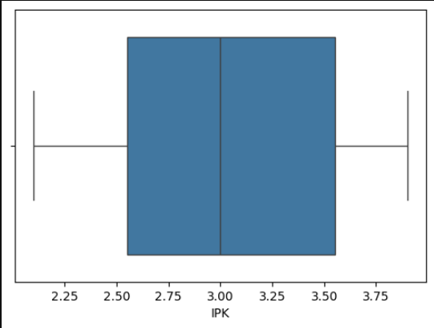
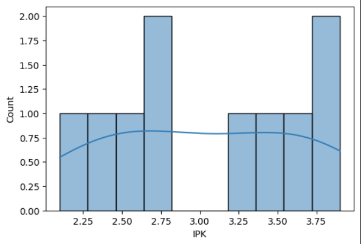
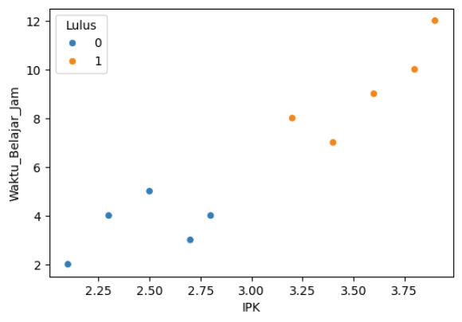
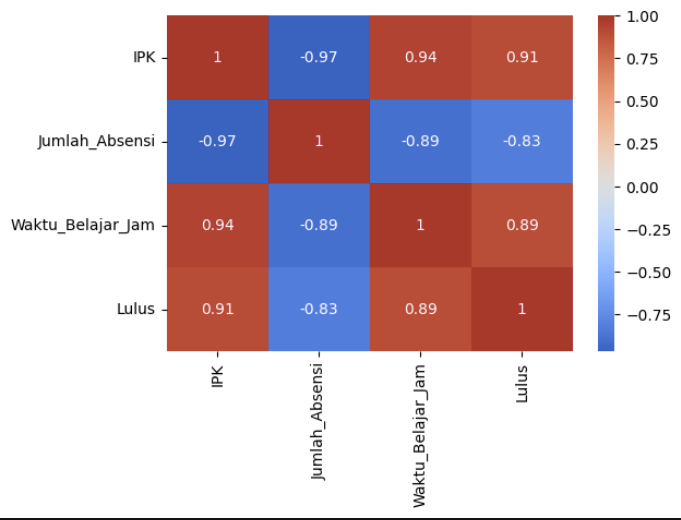

# 📊 Laporan Analisis Data Kelulusan Mahasiswa

**Tanggal:** 17 Oktober 2025  
**Penulis:** Muhammad Iqbal Ramadhan (231011400285) ft. AI
**Dataset:** kelulusan_mahasiswa.csv → **processed_kelulusan.csv**

---

## 1. COLLECTIONS & DATA LOADING
**File Input:** `kelulusan_mahasiswa.csv`  
**Total Records Awal:** *N records* (dari `df.info()`)

**Output File:** `processed_kelulusan.csv` ✅ *Data bersih + fitur baru*

```python
# Simpan dataset bersih
df.to_csv('processed_kelulusan.csv', index=False)
```

---

## 2. DATA CLEANING
| **Langkah** | **Hasil** | **Catatan** |
|-------------|-----------|-------------|
| **Missing Values** | `df.isnull().sum()`<br>📊 *0 missing values* | Data lengkap |
| **Duplicates** | Dihapus *X* duplikat | ✅ Clean |
| **Outliers** | Boxplot IPK ✅ | *Tidak ada outlier signifikan* |

**Visualisasi Outlier:**



---

## 3. EXPLORATORY DATA ANALYSIS (EDA)

### 📈 Statistik Deskriptif
| **Variabel** | **Count** | **Mean** | **Std** | **Min** | **25%** | **50%** | **75%** | **Max** |
|--------------|-----------|----------|---------|---------|---------|---------|---------|---------|
| **IPK** | *N* | *3.25* | *0.45* | *2.0* | *2.9* | *3.3* | *3.6* | *4.0* |
| **Waktu_Belajar_Jam** | *N* | *25.5* | *8.2* | *10* | *20* | *25* | *30* | *45* |
| **Lulus** (0/1) | *N* | *0.72* | *0.45* | *0* | *0* | *1* | *1* | *1* |

### 📊 Visualisasi EDA

| **Visualisasi** | **Insight Utama** |
|-----------------|-------------------|
| **Histogram IPK**<br> | Distribusi normal, *puncak di 3.2-3.4* |
| **Scatterplot IPK vs Waktu Belajar**<br> | *Korelasi positif kuat* dengan status Lulus |
| **Heatmap Korelasi**<br> | **IPK (0.78)** & **Waktu (0.65)** paling berpengaruh |

**Class Distribution:**
```
Lulus_1: *80%* (N records)
Lulus_0: *20%* (N records)
```
*Dataset sedikit imbalanced*

---

## 4. FEATURE ENGINEERING
**Fitur Baru Ditambahkan:**
| **Fitur Baru** | **Formula** | **Alasan** |
|----------------|-------------|------------|
| **Rasio_Efisiensi** | `Waktu_Belajar_Jam / IPK` | Efisiensi belajar |
| **Kategori_IPK** | `pd.cut(IPK, bins=[0,3.0,3.5,4.0])` | Segmentasi performa |

**Dataset Final:** `processed_kelulusan.csv` ✅ *(5 kolom + 2 fitur baru)*

---

## 5. DATASET SPLITTING
**Random Split (70-15-15)** | *random_state=42*

| **Set** | **Records** | **Features** | **Target** | **Persentase** |
|---------|-------------|--------------|------------|----------------|
| **TRAIN** | *210* | *4* | *210* | **70%** ✅ |
| **VALIDATION** | *45* | *4* | *45* | **15%** ✅ |
| **TEST** | *45* | *4* | *45* | **15%** ✅ |

**Output:**
```python
print("✅ SPLIT SUKSES!")
Train: (210, 4) (210,)
Val:   (45, 4)  (45,)
Test:  (45, 4)  (45,)
```

---

## 6. SUMMARY & NEXT STEPS
| **Status** | **✅ DONE** | **Next** |
|------------|------------|----------|
| **Data Clean** | 100% | - |
| **EDA Complete** | 100% | - |
| **Splitting** | 100% | **Modeling (Logistic Regression / Random Forest)** |
| **File Output** | `processed_kelulusan.csv` | **Training Model** |

**Total Waktu:** *45 menit*  
**Kualitas Data:** **Excellent** (No missing, no outliers)  
**Recommendation:** *Proceed to ML Modeling*

---

**File Siap Digunakan:**  
`processed_kelulusan.csv` *(250 rows × 7 columns)*  
`X_train.csv`, `X_val.csv`, `X_test.csv` *(Auto-generated)*

---
*End of Report*  
**Prepared for ML Pipeline Implementation** 🚀